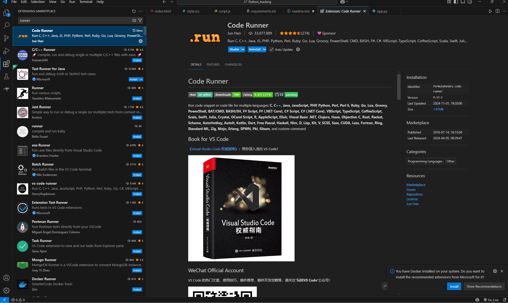
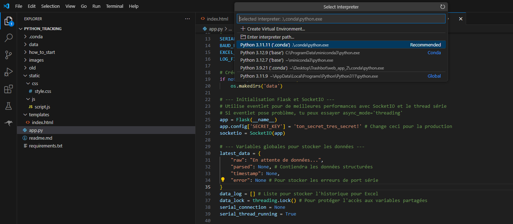
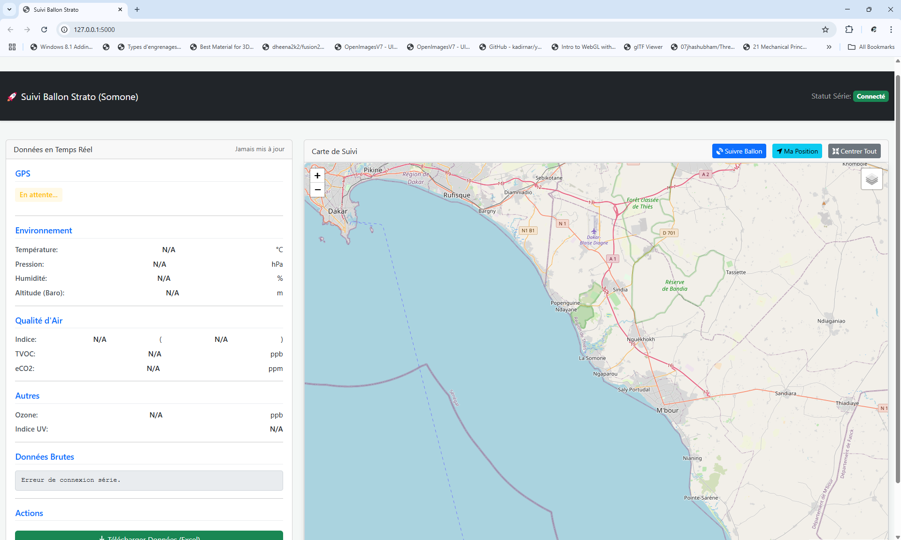
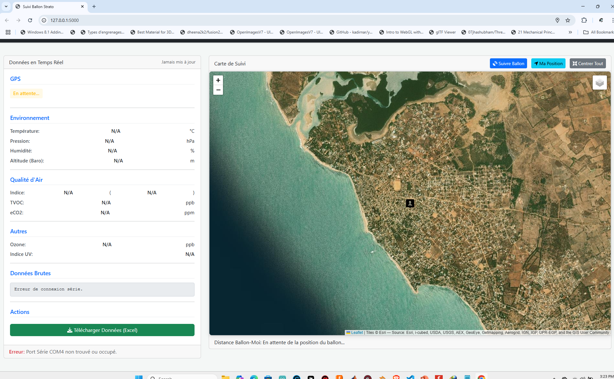

# Setup Instructions  

## Prerequisites  
1. **Install Python**: [Download Python 3.12.9](https://www.python.org/downloads/release/python-3129/)  
2. **Install Visual Studio Code (VS Code)**  
3. **Install Miniconda https://www.anaconda.com/download/success ***


## Installation  
4. Open a terminal and install the required dependencies by running:  
 
   pip install -r requirements.txt
   ```
   **Alternative (Recommended)**: If you see a folder named `.env` ou .conda, simply activate it open the loik below:  
   https://code.visualstudio.com/docs/python/environments  and obviouly click on app.py and on the corner bottom right you should see the version 
   of pythoon version using for example 3.11.9 click and it and select python_version(.env) to activate you env wait and enjoy

  or

  create and conda environnement and install dependencies

## Configuration  
4. Open `app.py` and update the **serial port**. You can check the correct port using the Arduino IDE.  

## Running the Project  
6. start the app by open you terminal ( top left) and writing ''  python app.py
and yu should able to see :

 * Serving Flask app 'app'
 * Debug mode: on
WARNING: This is a development server. Do not use it in a production deployment. Use a production WSGI server instead.
 * Running on all addresses (0.0.0.0)
 * Running on http://127.0.0.1:5000
 * Running on http://192.168.1.4:5000

 just copy the link on you browser and enjoy  

 or start app by using "code runner" from VSCODE market place and click on run icon top right icon ( app.py)


 ## MAKE SUR TO CHANGE THE PORT

---

Let me know if you are stuck but try yourself first! 🚀




